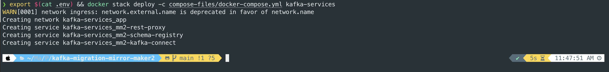
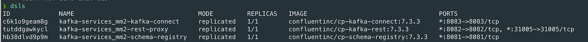

# kafka-migration-mirror-maker2
Mirror Maker 2 using Kafka Connect

### Update following variables in .env file for your needs:
- BOOTSTRAP_SERVERS - your destination/target Kafka brokers
- SCHEMA_REGISTRY_HOSTNAME - test.company.com
- CONNECT_REST_ADVERTISED_HOST_NAME - test.company.com
- KAFKA_REST_HOST_NAME - test.company.com

### Run Kafka services using docker swam
```
source .env && docker stack deploy -c compose-files/docker-compose.yml kafka-services
```

### Check status of Docker swarm services
```
docker service ls
```

